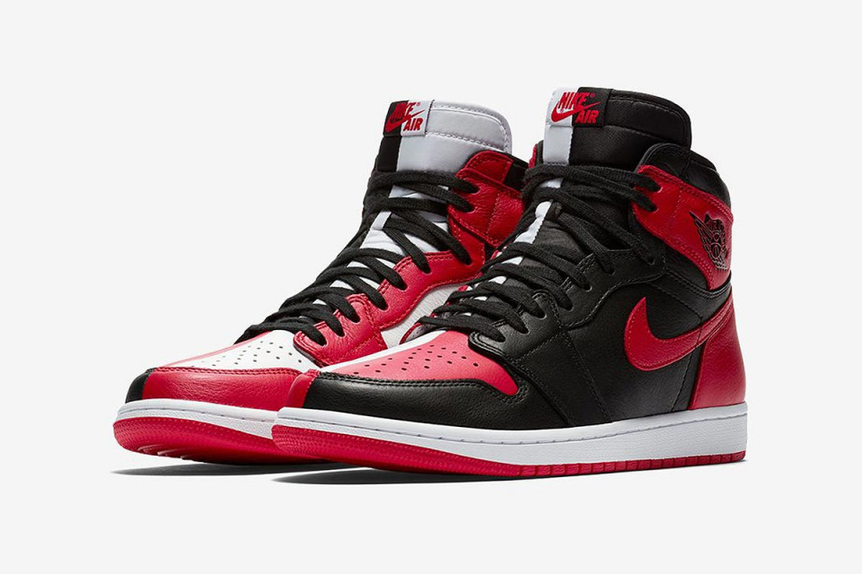

<!DOCTYPE html>
<html lang="en">
<head>
    <meta charset="UTF-8">
    <title>Home</title>
    <link rel="stylesheet" href="Bootstrap/css/bootstrap.css">
    <link rel="stylesheet" href="Custom.css">
    <link rel="stylesheet" href="Bootstrap/fonts/css/all.css">

</head>
<body>
<!--Navbar section-->
<nav class="navbar bg-danger">
    <h1 class="Js">John Shoe Craft</h1>

        <form class="form-inline ">
            

                <input type="text" class="form-control" placeholder="Search for something">
                

                    <button type="button" class="btn">
                        <i class="fas text-muted fa-search"></i>
                    </button>
                

            

        </form>

    <!--Sign in-->

    <ol class="navbar-nav">
        <li class="nav-item ">
            <button type="button" class="btn btn-outline-danger text-light" data-toggle="modal" data-target="#myModal">
                <i class="fa fa-user"></i>Sign In
            </button>

                    <!--Modal Form-->

            

                

                    

                            <!--Modal Heading & Body-->
                        

                            <h4 class="modal-title text-danger">My Account</h4>
                            <button type="button" class="close" data-dismiss="modal">&times;</button>
                        

                            

                                

                                
                                    <!--Sign In Form-->
                                <form >
                                    

                                        <label for="email">email address:</label>
                                        <input type="email" id="email" class="form-control" placeholder="Enter Email">
                                    

                                    

                                        <label for="Password">Password</label>
                                        <input type="text" id="Password" name="Password" class="form-control" placeholder="Enter Password">
                                    

                                     
                                    

                                        <button type="submit" class="btn btn-outline-danger form-control " style="padding:25px">Sign-In</button>
                                    

                                     
                                    

                                        <label class="form-check-label">
                                            <input class="form-check-input" type="checkbox" name="remember"> Remember me
                                        </label>
                                    

                                    

                                        <button type="submit" class="btn btn-outline-warning form-control " style="padding:25px">Create Account</button>
                                    

                                </form>
                                    <!--End Of Sign In Form-->
                            

                            

                            <!--End of Modal Heading & body-->
                    

                

            

                    <!--end of Modal Form-->

        </li>
    </ol>

    <!--end of Sign in-->
     

</nav>

<nav class="navbar navbar-expand-md navbar-light bg-danger">

        <ul class="navbar-nav">

            <li class="nav-item dropdown" data-toggle="dropdown"><a class="nav-link text-light small font-weight-bold dropdown-toggle" href="#"><i class="fas fa-bars fa-1x"></i></a>
                

                    <a class="dropdown-item" href="#">Male</a>
                    <a class="dropdown-item" href="#">Female</a>
                    <a class="dropdown-item" href="#">Sneakers</a>
                    <a class="dropdown-item" href="#">Official</a>
                    <a class="dropdown-item" href="#">Boots</a>
                    <a class="dropdown-item" href="#">Sandles</a>
                

            </li>

            <li class="nav-item">
                <a class="nav-link text-light small font-weight-bold" href="Home.html">Home</a>
            </li>
            <li class="nav-item">
                <a class="nav-link text-light small font-weight-bold" href="#New Releases">New Releases</a>
            </li>
            <li class="nav-item">
                <a class="nav-link text-light small font-weight-bold" href="#Trending">Top Trending</a>
            </li>
            <li>
                <a class="nav-link text-light small font-weight-bold" href="#">Men</a>
            </li>
            <li>
                <a class="nav-link text-light small font-weight-bold" href="#">Women</a>
            </li>
            <li>
                <a class="nav-link text-warning text-capitalize font-weight-bold" href="ContactUs.html">Contact us</a>
            </li>
            <li>
                <a class="nav-link text-warning text-capitalize font-weight-bold" href="AboutUs.html">About us</a>
            </li>
            <li>
                <a class="nav-link text-warning text-capitalize font-weight-bold" href="#Footer">More</a>
            </li>
        </ul>

</nav>
<!--End of navbar section-->

<!--Carousel(picture) Section-->

            

                <!--Slide Indicator-->
                <ul class="carousel-indicators">
                    <li data-target="#my-Slider" data-slide-to="0" class="active"></li>
                    <li data-target="#my-Slider" data-slide-to="1" ></li>
                    <li data-target="#my-Slider" data-slide-to="2"></li>
                </ul>

                <!--Slide Wrappers-->
                

                    

                        

                            <h2>Custom Air Force 1</h2>
                            
Now at Ksh1500

                        

                    

                    

                        

                            <h2>Colored Haurache</h2>
                            
Now at Ksh2000

                        

                    

                    

                        

                            <h2>Green Haurache</h2>
                            
Now at Ksh2500

                        

                    

                

                <!--Control Buttons-->
                
                

            

        

    

<!--End of carousel section-->

<!--Top New Release Section-->
<section class="p-5 ">
    

        <!--Title(New Release)-->
        

            

                <h2 class="text-danger">New Releases</h2>
                
<i>We offer the latest products to keep you on the edge</i>

            

        

        <!--end title(New Release)-->

        <!--New Release division-->
        

            

                    

                        

                                        

                                            <h5 class="font-weight-bold">Air Jordans</h5>
                                            

                                            
<b>ksh.2000</b>

                                            <button type="submit" class="btn btn-danger form-control" style="border-radius: 0px">Buy</button>
                                             
                                            <button type="submit" class="btn btn-outline-warning form-control"  style="border-radius: 0px">Add to Cart</button>
                                             
                                            <a class="btn-outline-primary small" href="#">MORE</a>
                                             
                                        

                                        

                                            <h5 class="font-weight-bold">heels</h5>
                                            

                                            
<b>ksh.2000</b>

                                            <button type="submit" class="btn btn-danger form-control" style="border-radius: 0px">Buy</button>
                                             
                                            <button type="submit" class="btn btn-outline-warning form-control" style="border-radius: 0px">Add to Cart</button>
                                             
                                            <a class="btn-outline-primary small" href="#">MORE</a>
                                             
                                        

                                        

                                            <h5 class="font-weight-bold">Air Jordans</h5>
                                            

                                            
<b>ksh.2000</b>

                                            <button type="submit" class="btn btn-danger form-control" style="border-radius: 0px">Buy</button>
                                             
                                            <button type="submit" class="btn btn-outline-warning form-control" style="border-radius: 0px">Add to Cart</button>
                                             
                                            <a class="btn-outline-primary small" href="#">MORE</a>
                                             
                                        

                                        

                                            <h5 class="font-weight-bold">GreenHaurache</h5>
                                            

                                            
<b>ksh.2500</b>

                                            <button type="submit" class="btn btn-danger form-control" style="border-radius: 0px">Buy</button>
                                             
                                            <button type="submit" class="btn btn-outline-warning form-control" style="border-radius: 0px">Add to Cart</button>
                                             
                                            <a class="btn-outline-primary small" href="#">MORE</a>
                                             
                                        

                        

                    

            

        

    

</section>
<!--END OF New Release Section-->

<!--Categories division-->
        <section >
            

                

                <!--title (Categories)-->
                

                    

                        <h4 class="text-secondary">What on your mind?</h4>
                    

                

                <!--end title (Categories)-->

                    <!--Categories links-->
                   

                       

                           

                               <a href="#">
                                   
                                    
                                   <h6 class="text-danger">From  <b>Jordan</b></h6>
                               </a>
                           

                           

                               <a href="#">
                                   
                                   <h6 class="text-danger">Sneakers</h6>
                               </a>
                           

                           

                               <a href="#">
                                   
                                   <h6 class="text-danger">Heels</h6>
                               </a>
                           

                           

                               
                                
                               <h6 class="text-danger">From <b>Timberland</b></h6>
                           

                           

                               
                                
                               <h6 class="text-danger">From <b>Nike</b></h6>
                           

                       

                       
                   

                    <!--end of Categories links-->
                

            

        </section>
<!--End of Categories Division-->

<!--New Release Division-->
<section class="p-5">
            

                <!--Title(Trending)-->
                

                    

                        <h4 class="text-danger">Trending</h4>
                        
The hottest shoes in the streets

                    

                

                <!--End of Title(Trending)-->
                

                    

                        <a class="text-dark" href="#"><h5>NMD's</h5>
                        
                        
                        </a>
                    

                    

                        <a  class="text-dark" href="#"> <h5>Pump Heels</h5>
                        
                        
                        </a>
                    

                    

                        <a class="text-dark" href="#"> <h5>Loafers</h5>
                        
                        
                        </a>
                    

                

                <!--Trending Division-->
               
                <!--End of Trending Division-->
            

</section>

<!--Footer-->
<Footer class="bg-danger">
    

        

            <!--Come join us-->
            

                <h3 class="text-light ">Come Join us</h3>
                

                

                    <a href="https://www.facebook.com/">
                        <i class="fab fa-facebook-f fa-2x" style="color: white"></i>
                    </a>
                     
                

                

                    <a href="https://www.instagram.com/">
                        <i class="fab fa-instagram fa-2x" style="color: white"></i>
                    </a>
                     
                

                

                    <a href="https://www.Twitter.com/">
                        <i class="fab fa-twitter fa-2x" style="color: white"></i>
                    </a>
                     
                

                

                    <a href="https://www.whatsapp.com/">
                        <i class="fab fa-whatsapp fa-2x" style="color: white"></i>
                    </a>
                     
                

            

            <!--Get to Know Us-->
            

                <h3 class="text-light ">Get to know us</h3>
                

                <a class="text-light" href="AboutUs.html">About us</a>
                 
                <a class="text-light" href="ContactUs.html">Contact Us</a>
                 
                <a class="text-light" href="#">Terms & Conditions</a>
            

            <!--End Of Get To Know Us-->

            <!--Payment Options-->
            

                <h3 class="text-light">Payment Options</h3>
                

                <a href="#"><i class="fa fa-credit-card text-light fa-1x"> Credit card</i></a>
                 
                <a href="#"><i class="fab fa-cc-mastercard text-light fa-1x">Master Card</i></a>
            

            <!--End Of Payment Options-->

            <!--Help-->
            

                <h3 class="text-light">Help</h3>
                

                <a class="text-light" href="#">My Account</a>
                 
                <a class="text-light" href="#">FAQ</a>
                 
                <a class="text-light" href="#">Your Orders</a>
                 
                <a class="text-light" href="ContactUs.html">Managing Content & Devises</a>
            

            <!--End of Help-->

        

    

</Footer>
<!--Footer-->

</body>
</html>
